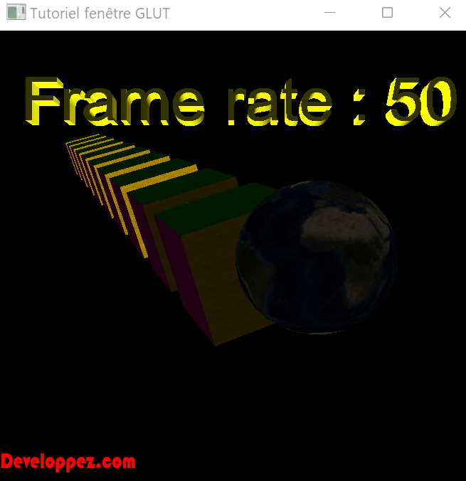
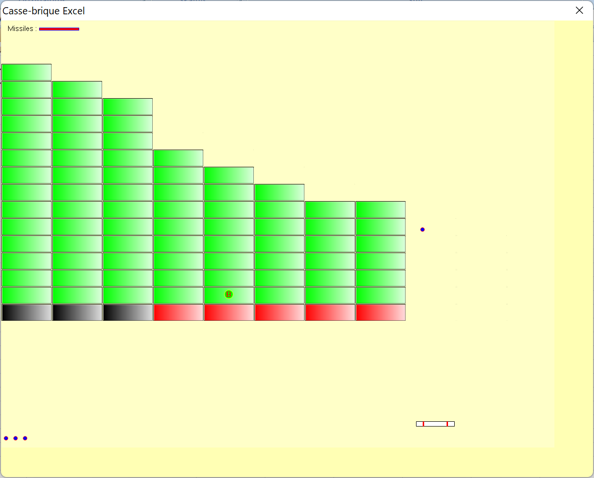
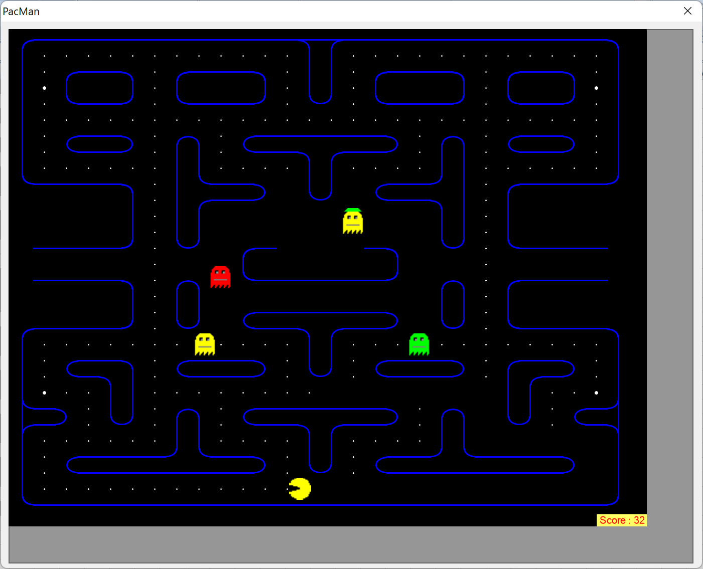
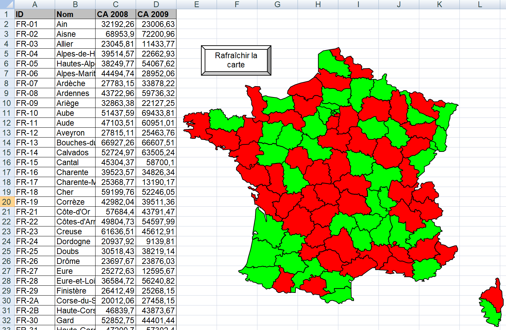

# Examples from arkham46.developpez.com: VBA was used to run OpenGL, create games using GDI+ and create interactive infographics!

In this GitHub I want to share examples from web site of [Thierry Gasperment](arkham46.developpez.com). Although all samples and descriptions are open source, you have to register on the web site. Nevertheless, it's worth to register if you want to go deeper into details because the site contains tons of very helpful info. To translate the site I recommend Chrome. 

## OpenGL
[[Original tutorial (11 lessons) can be read here, no authorization is necessary](https://arkham46.developpez.com/articles/office/vbaopengl/?page=Page_1)].
The [last lesson](https://arkham46.developpez.com/articles/office/vbaopengl/?page=Page_11) contains a collection of examples:
 - [[VBA modules for OpenGL (original link, authorization necessary)](https://arkham46.developpez.com/articles/office/vbaopengl/fichiers/packopenglvb.zip)] 
 [[GitHub](./1.%20OpenGL/packopenglvb.zip)]
  - [[FreeGLUT library (original link, authorization necessary)](https://arkham46.developpez.com/articles/office/vbaopengl/fichiers/freeglutdll.zip)] 
 [[GitHub](./1.%20OpenGL/freeglutdll.zip)]
  - [[Demo with using of FreeGlut (original link, authorization necessary)](https://arkham46.developpez.com/articles/office/vbaopengl/fichiers/VBAOpenGLExcel-freeglut.zip)] 
 [[GitHub](1.%20OpenGL/VBAOpenGLExcel-freeglut.zip)]
  - [[Demo without using of FreeGlut (original link, authorization necessary)](https://arkham46.developpez.com/articles/office/vbaopengl/fichiers/VBAOpenGLExcel.zip)] 
 [[GitHub](./1.%20OpenGL/VBAOpenGLExcel.zip)]

Example: 

## GDI+ and games
Thierry has created two descriptions on how to add GDI+ to VBA: [original link, no authorization necessary](https://arkham46.developpez.com/articles/office/clgdiplus/doc/) and [original link, no authorization necessary](https://arkham46.developpez.com/articles/office/clgdiplus/tuto/tuto-apprendre-gdiplus/).

And now the classic games!

### Clone of Moorhuhn (Tir au coincoin)
[[GitHub](2.%20GDP%2B%20%26%20Games/1.%20Coin%20hunt/coincoin-excel.zip)], [[original link, authorization necessary](https://arkham46.developpez.com/articles/office/clgdiplus/fichiers/coincoin-excel.zip)]

### Arkanoid (casse-brique)
[[GitHub](2.%20GDP%2B%20%26%20Games/2.%20Arkanoid/casse-brique.zip)], [[original link, authorization necessary](https://arkham46.developpez.com/articles/office/clgdiplus/fichiers/casse-brique.zip)]

Use mouse to move. Space to fire.

### Jeu de tir (shooter a la "Xenon")
[[GitHub](2.%20GDP%2B%20%26%20Games/3.%20Xenon/jeu-tir-excel.zip)], [[original link, authorization necessary](https://arkham46.developpez.com/articles/office/clgdiplus/fichiers/jeu-tir-excel.zip)]

Use arrows to move the space ship. "Ctrl" to fire. The second player must use joystick. 
The original link contains a small error: In the "RunGame" ("clGame" class) subroutine I changed "config" to "data/config". The GitHub version contains corrected version.

### Jeu de tir (Space invaders)
[[GitHub](2.%20GDP%2B%20%26%20Games/4.%20Space%20invaders/tuto-game-2-excel.zip)], [[original link, authorization necessary](https://arkham46.developpez.com/articles/office/clgdiplus/tuto/tutoclgdiplusgame2/fichiers/tuto-game-2-excel.zip)]

Use arrows to move the space ship. Space to fire.

### Pacman
A step-by-step description of Pacman VBA code exist in ([original link, no authorization necessary](https://arkham46.developpez.com/articles/office/clgdiplus/tuto/tutoclgdiplusgame3/?page=Page_1)). 

If you want to start the game immediately: [[GitHub](./2.%20GDP%2B%20%26%20Games/5.%20Pacman/pacman-excel.zip)], [[original link, authorization necessary](https://arkham46.developpez.com/articles/office/clgdiplus/tuto/tutoclgdiplusgame3/fichiers/pacman-excel.zip)]

Use arrows to move the Pacman. 

## Infographics
### Map of France with departments
For infographics it is very useful to have a map to show the statistic. A step-by-step description of creating of map of France with departments is shown in the link: [original link, no authorization necessary](https://arkham46.developpez.com/articles/office/dessincarte/). The map of France is created from the paths in column A. The easiest way to create paths is to copy them from SVG file. The function "ImportSVG" opies paths from the "[[Départements_et_régions_de_France.svg](./3.%20Map%20of%20France/Départements_et_régions_de_France.svg)]" (must be in the same folder as the table) to the column A. The map should be deleted before. You can also repaint the map by using the function "CreateShapes" that uses paths' in column A. The map should be removed in this case either.

An example can be downloaded from here: [[GitHub](./3.%20Map%20of%20France/Map.xls)], [[original link, authorization necessary](https://arkham46.developpez.com/articles/office/dessincarte/fichiers/mapxl.zip)].

### Interactive infographics
[[GitHub](./3.%20Map%20of%20France/CarteCA.xls)], [[original link, authorization necessary](https://arkham46.developpez.com/articles/office/dessincarte/fichiers/carteca.zip)]
In an example of interactive infographics the department is painted green if its value in 2009 was above the value of 2008. Otherwise it will be painted red. Actually, no refreshment button is necessary.

### Game of departments
[[GitHub](./3.%20Map%20of%20France/JeuDepartements.xls)], [[original link, authorization necessary](https://arkham46.developpez.com/articles/office/dessincarte/fichiers/jeudepartements.zip)]
And finally, the "Game of departments". The purpose of the game is to click the correct department (shown in cell "C2") on the map. In case of error clicked department is shown in cell "C3". The current count is presented in cell "C4". 
